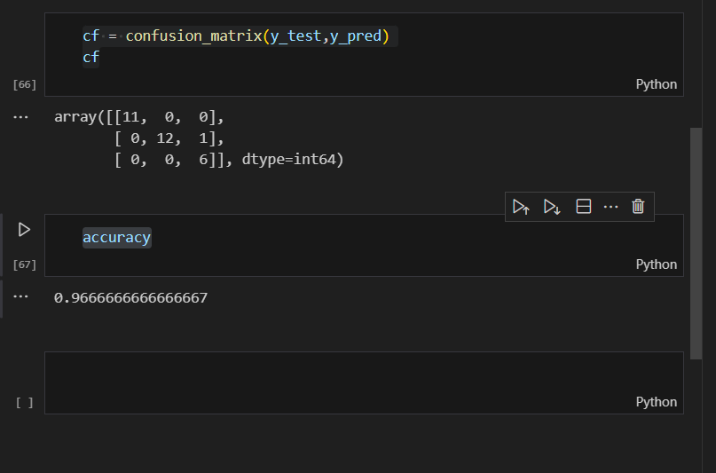

# SGD-Classifier
## AIM:
To write a program to predict the type of species of the Iris flower using the SGD Classifier.

## Equipments Required:
1. Hardware – PCs
2. Anaconda – Python 3.7 Installation / Jupyter notebook

## Algorithm
1. IMPORTING NECESSARY LIBERARIES
2. DATA PROCESSING
3. SPLITING DATA INTO TRAINNING AND TESTING 
4. IMPORTING SGD CLASSIFIER FROM SKLEARN
5. ACCURACY SCORE

## Program:
```
/*
Program to implement the prediction of iris species using SGD Classifier.
Developed by: NEMALESHWAR H
RegisterNumber: 212223230142
*/
```
```py
import pandas as pd
from sklearn.datasets import load_iris
from sklearn.linear_model import SGDClassifier
from sklearn.model_selection import train_test_split
from sklearn.metrics import accuracy_score, confusion_matrix
import matplotlib.pyplot as plt
import seaborn as sns

```
```py
iris = load_iris()
df= pd.DataFrame(data=iris.data,columns=iris.feature_names)
df['target'] =iris.target

```
```py
x= df.drop('target',axis=1)
y= df['target']
```
```py
x_train,x_test,y_train,y_test= train_test_split(x,y,test_size=0.2,random_state=1)
sgd= SGDClassifier(max_iter =1000,tol=1e-3)
sgd.fit(x_train,y_train)

```
```py
y_pred= sgd.predict(x_test)
accuracy= accuracy_score(y_test,y_pred)
cf = confusion_matrix(y_test,y_pred)
cf
accuracy
```

## Output:


## Result:
Thus, the program to implement the prediction of the Iris species using SGD Classifier is written and verified using Python programming.
